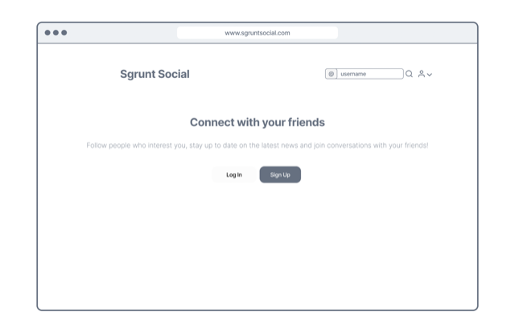
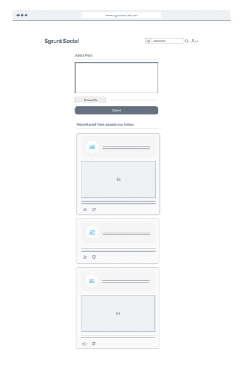
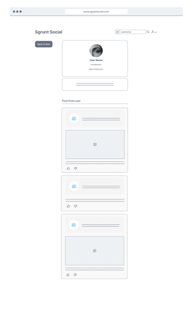
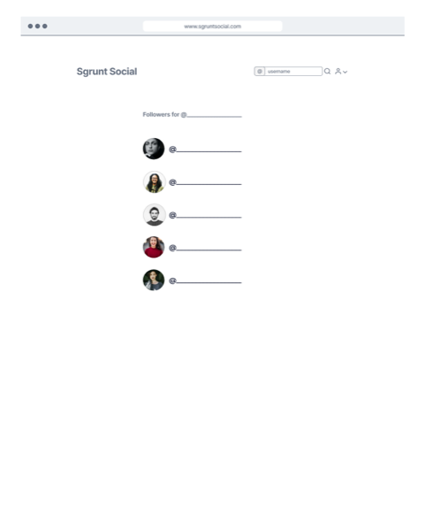
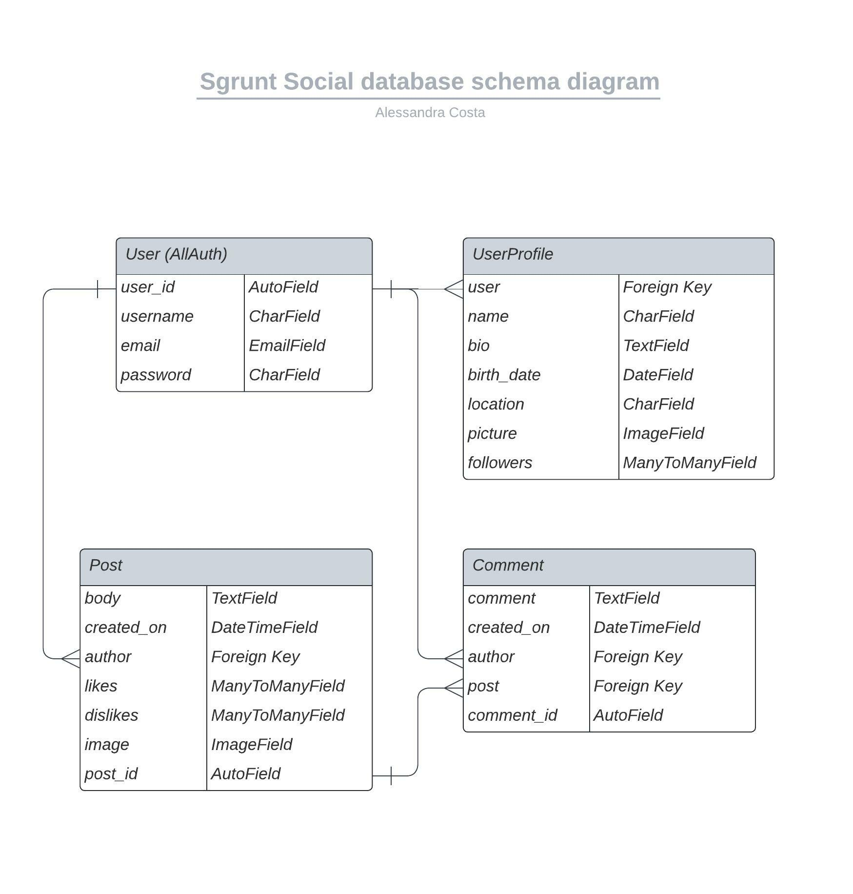

# Sgrunt Social

Sgrunt social is a social network dedicated to share news and articles and allow the users to share their opinion and ideas about it. The app is targeted to towards people that enjoy commenting and sharing their ideas about what is going on in the world.

The name of the app comes from the tipical expression from classic comic books, when the carachters wanted to express their disappointment.

The live link can be found here - [Sgrunt Social](https://sgrunt-social.herokuapp.com/)

&nbsp;

## Table of Contents
---
- [Agile Methodology](#agile-methodology)
    - [User Stories](#user-stories)
- [Design](#design)
- [Data Model](#data-model)
- [Technologies](#technologies)
- [Credits](#credits)

&nbsp;

## Agile Methodology
---
Github projects was used to manage the development process using an agile approach. Please see link to project board [here](https://github.com/users/alessandracosta8/projects/3)
Three iterations were documented within the Github project as Milestones. A Github Issue was created for each User Story which was then allocated to an Iteration and rated according to their importance and urgency.

### User Stories

#### Epic: Login, Users and Follow
- As a **User** I can **login** so that **I can interact with the content or create content**.
- As a **User** I can **follow or unfollow other users** so that **I can be updated on what the people I want to follow are posting, or stop it**.
- As a **User** I can **have my own profile** so that **I can share my info and display all of my posts**.
- As a **User** I can **edit my profile** so that **I can edit my informations**.
- As a **User** I can **click on any post or comment author** so that **I can view the full profile of that user**.
- As a **User** I can **search in the navbar for other users** so that **I can easily find people I want to connect with**.
- As a **User** I can **see the follower list of users** so that **I am aware of user who follow me and that follow others**.

#### Epic: Post and comment
- As a **User** I can **post some text** so that I can **share my thoughts or ideas**.
- As a **User** I can **comment on somebody's post** so that I can **share my thoughts or ideas on that topic**.
- As a **User** I can **click on a Post** so that **I can read the post's page and view all of its comments**.
- As a **User** I can **edit or delete a post** so that **I can change what I've shared or delete it**.
- As a **User** I can **delete a comment** so that **I can change what I've shared or delete it**.
- As a **User** I can **view only the posts of the users I follow** so that **I can focus only on the content I care about**.
- As a **User** I can **like or upvote a post** so that I can **express my preference for the post**.
- As a **User** I can **upload an image** so that **I can share it with my followers**.

#### Epic: Future Features
- As a **User** I can **login with Apple or Google account** so that **I can signup without creating an account**.

&nbsp;

## Design
---
The website has a simple an minimalistic design, to leave all the user attention on the content written by the users and the images shared. The colours choosen are subtle and in grey tones to leave all the colour brilliance to the images posted.

### Wireframes

Landing page

Post List

Profile

Post Detail

Followers List

&nbsp;

## Data Model
---
I used principles of Object-Oriented Programming throughout this project and Django’s Class-Based Generic Views.
Django AllAuth was used for the user authentication system.

In order to create the social network various models were required: the post, comment and user profile.
The author is a foreign key that is shared in-between the post and comment model. All of the models are based on the use of the generic User model from Django.

The Post model in specific has multiples fields which allow the post to have amongst its features: likes, dislikes and images attached. In particular two views are put in place (AddLike and AddDislike), which will manage the like functionality so that a post that is dislked cannot be liked at the same time and viceversa.

The Comment model is a more simple model taking as the foreign keys the post it is related to and the author of the comment itself.

The UserProfile model takes the User model as base structure and attaches the various details needed, including a profile picture that the user can upload and the list of followers the user currently has.

The diagram below details the database schema.

&nbsp;

## Testing
---

### Bugs
- When setting DEBUG = False was setup, error 500 was returned and no content was accessible.

&nbsp;

## Technologies
---
- [GitHub](https://github.com/) - for version control and product backlog.
- [Notion](https://notion.so/) - for notes taking and tasks manager.
- [GitPod](https://gitpod.io/) - as development environment.
- [Heroku](https://heroku.com/) - as cloud based platform to deploy the web app on.
- [PostgreSQL](https://postgresql.org/) - as database.
- [DJ database url](https://pypi.org/project/dj-database-url/) - database setup.
- [Psycopg](https://pypi.org/project/psycopg2/) - PostgreSQL database adapter for Python.
- [Django AllAuth](https://django-allauth.readthedocs.io/en/latest/installation.html) - for authentication of users.
- [Django Crisy Forms](https://django-crispy-forms.readthedocs.io/en/latest/) - for forms styling.

## Credits
---
- Code Institute tutor support for all the support they provided.
- [Django AllAuth Templates](https://github.com/pennersr/django-allauth)
- [Django Documentation](https://docs.djangoproject.com/en/4.1/)
- [Mozilla Django Testing Tutorials](https://developer.mozilla.org/en-US/docs/Learn/Server-side/Django/Testing)
- [Django testing tutorials](https://www.youtube.com/watch?v=qwypH3YvMKc&list=PLbpAWbHbi5rMF2j5n6imm0enrSD9eQUaM)
- [PyLint tutorial](https://www.youtube.com/watch?v=w6bRHNC7Kuc&t=30s)
- [Django social media app tutorial](https://www.youtube.com/playlist?list=PLPSM8rIid1a3TkwEmHyDALNuHhqiUiU5A)
- [Unsplash free stock photos](https://unsplash.com/)
- [FontAwsome Icons](https://fontawesome.com/)
- [Django quering (Q)](https://docs.djangoproject.com/en/3.1/topics/db/queries/)
- [Heroku deployment](https://www.youtube.com/watch?v=XZoTukqekzY)
- [Lucidchart](https://lucid.app/documents#/dashboard) - used to create the database schema design
- [Figma](https://www.figma.com/) - used to create wireframes